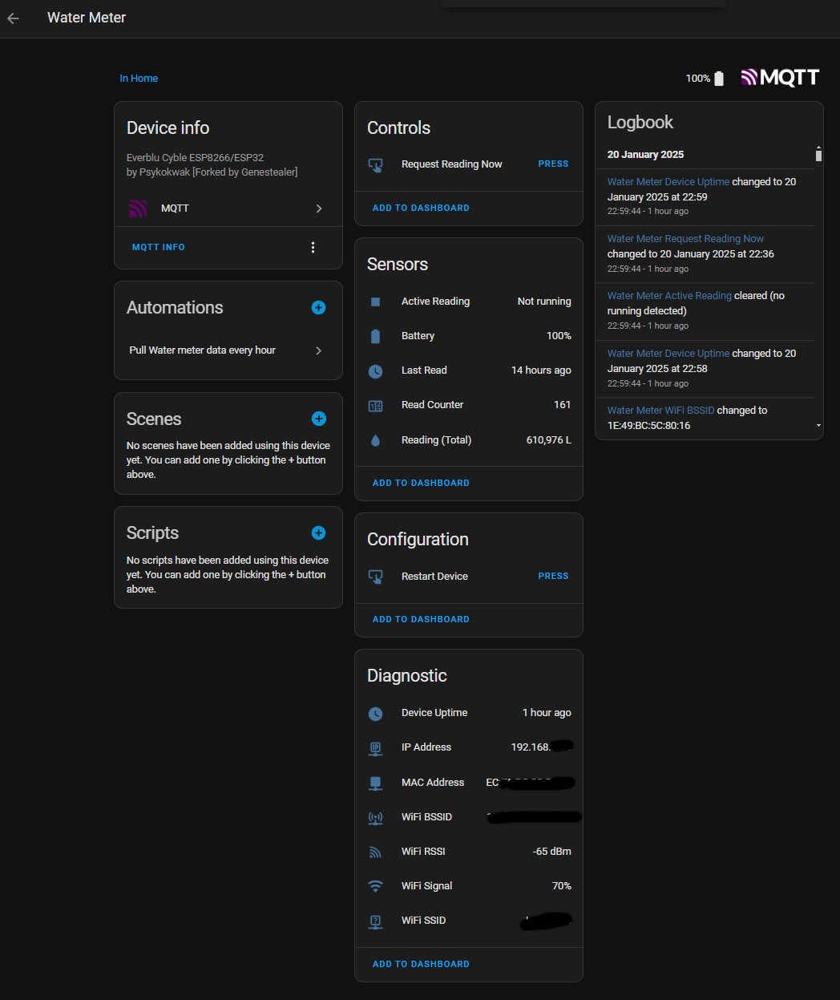
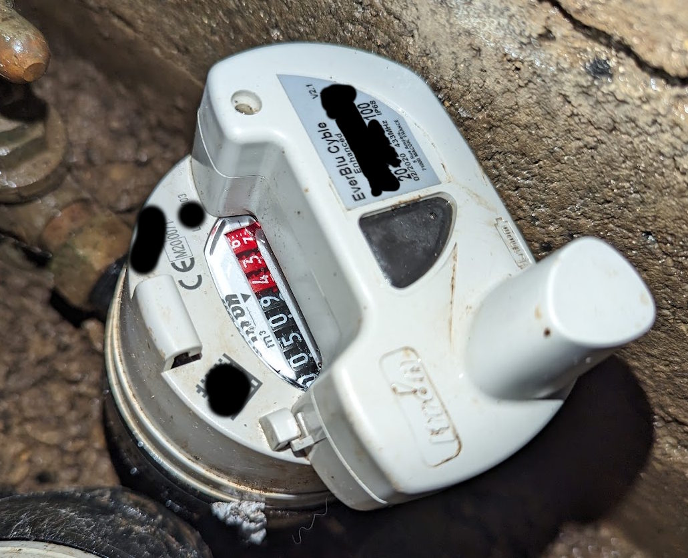

# everblu-meters-esp8266/esp32 - Water usage data for Home Assistant
Fetch water/gas usage data from Itron EverBlu Cyble RF Enhanced water meters using RADIAN protocol on 433Mhz using an ESP32/ESP8266 and CC1101 transceiver. Integrated with Home Assistant via MQTT AutoDiscovery. 



Software original code (but also all the hard work to get things working was originally done [here](http://www.lamaisonsimon.fr/wiki/doku.php?id=maison2:compteur_d_eau:compteur_d_eau) then put on github by @neutrinus [here](https://github.com/neutrinus/everblu-meters) and then forked by [psykokwak](https://github.com/psykokwak-com/everblu-meters-esp8266)

Meters supported:
- [Itron EverBlu Cyble Enhanced](https://multipartirtaanugra.com/wp-content/uploads/2020/09/09.-Cyble-RF.pdf)




## Hardware
The project runs on ESP8266/ESP32 with an RF transreciver (CC1101). Hardware can be any ESP32+CC1101 with correct wiring.


### Connections (ESP32/ESP8266 to CC1101):
- See `cc1101.ccp` for SPI pins mapping.
- See `everblu_meters.h` for GDOx pins mapping.

Pins wiring for [Wemos D1 board](https://www.wemos.cc/en/latest/d1/index.html) and [Adafruit Feather HUZZAH ESP8266](https://www.wemos.cc/en/latest/d1/index.html](https://learn.adafruit.com/adafruit-feather-huzzah-esp8266/pinouts)):

| **CC1101**  | **Wemos** | **HUZZAH ESP8266** | **Notes**                                      |
|-------------|-----------|---------------------------|------------------------------------------------|
| VCC         | 3V3       | 3V                       | Connect to the 3.3V power pin.                |
| GDO0        | D1        | GPIO5                    | General-purpose digital output.               |
| CSN         | D8        | GPIO15                   | SPI chip select; Feather has GPIO15 as CS.    |
| SCK         | D5        | GPIO14                   | SPI clock pin; SPI SCK maps to GPIO14.        |
| MOSI        | D7        | GPIO13                   | SPI MOSI pin; maps to GPIO13 on the Feather.  |
| GDO1 (MISO) | D6        | GPIO12                   | SPI MISO pin; maps to GPIO12 on the Feather.  |
| GDO2        | D2        | GPIO4                    | Another general-purpose digital output.       |
| GND         | G         | GND                      | Connect to ground.                            |

### CC1101
Some modules are not labelled on the PCB, this is the pinout for one:


## Configuration
1. Download [Visual Studio Code](https://code.visualstudio.com/)
1. Install [PlatformIO for VS Code](https://platformio.org/) (this will install all dependencies required)
1. Update WiFi and MQTT details in everblu-meters-esp8266.cpp, if you do not use username and password 1or MQTT then comment those out with //
1. Set meter serial number (without the leading 0) and production year in `everblu_meters.h` (at the end 1f the file), it can be found on the meter label itself:
1[Cyble Meter Label](meter_label.png)
1. Flash the sketch to your ESP device
1. After a few second your meter data should be on the screen (serial console) and data should be pushed 1o MQTT.
1. The device will query the meter once a day, every 24 hours and retry every hour if query failed.

## Troubleshooting

### Frequency adjustment
Your transreciver module may be not calibrated correctly, please modify frequency a bit lower or higher and try again. You may use RTL-SDR to measure the offset needed.
You can uncomment the part of the code in the `everblu-meters-esp8266.cpp` file that scans all the frequencies around the meter frequency to find the correct one.

```
  // Use this piece of code to find the right frequency.
  for (float i = 433.76f; i < 433.890f; i += 0.0005f) {
    Serial.printf("Test frequency : %f\n", i);
    cc1101_init(i);

    struct tmeter_data meter_data;
    meter_data = get_meter_data();

    if (meter_data.reads_counter != 0 || meter_data.liters != 0) {
      Serial.printf("\n------------------------------\nGot frequency : %f\n------------------------------\n", i);

      Serial.printf("Liters : %d\nBattery (in months) : %d\nCounter : %d\n\n", meter_data.liters, meter_data.battery_left, meter_data.reads_counter);

      digitalWrite(LED_BUILTIN, LOW); // turned on

      while (42);
    }
  }
```


### Business hours
> [!TIP]
> Your meter may be configured in such a way that is listens for request only during hours when data collectors work - to conserve energy. If you are unable to communicate with the meter, please try again during business hours (8:00-16:00), Monday to Friday. As a rule of thumb, please try to set up your device only during business hours, then you can avoid confusion and asking questions why is it not working!

> [!NOTE]
> Note: This is definitely the case in the UK.

### Serial number starting with 0
Please ignore the leading 0, provide serial in configuration without it.


## Origin and license

This code is based on code from http://www.lamaisonsimon.fr/wiki/doku.php?id=maison2:compteur_d_eau:compteur_d_eau 


The license is unknown, citing one of the authors (fred):

> I didn't put a license on this code maybe I should, I didn't know much about it in terms of licensing.
> this code was made by "looking" at the radian protocol which is said to be open source earlier in the page, I don't know if that helps?
